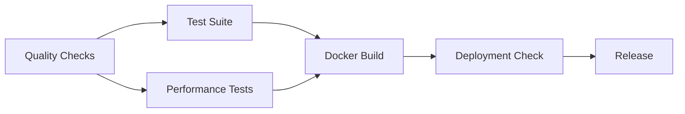

# CI/CD Setup Guide

## Overview

This repository includes a comprehensive CI/CD pipeline template that needs to be manually set up due to GitHub workflow permissions.

## Setup Instructions

### 1. Create GitHub Workflows Directory

```bash
mkdir -p .github/workflows
```

### 2. Copy CI/CD Template

Copy the contents of `CI_CD_TEMPLATE.yml` to `.github/workflows/ci.yml`:

```bash
cp CI_CD_TEMPLATE.yml .github/workflows/ci.yml
```

### 3. Configure Repository Settings

#### Enable GitHub Actions
1. Go to repository Settings → Actions → General
2. Select "Allow all actions and reusable workflows"

#### Set up Branch Protection Rules
1. Go to Settings → Branches
2. Add rule for `main` branch
3. Enable:
   - Require status checks to pass before merging
   - Require branches to be up to date before merging
   - Include administrators

#### Configure Secrets (Optional)
For automatic PyPI publishing, add these secrets in Settings → Secrets:
- `PYPI_TOKEN`: Your PyPI API token

### 4. Test the Pipeline

1. Push the workflow file:
```bash
git add .github/workflows/ci.yml
git commit -m "add: CI/CD pipeline configuration"
git push
```

2. Create a test pull request to verify the pipeline runs correctly

## Pipeline Features

The CI/CD pipeline includes:

### Quality Checks
- **Multi-Python Support**: Tests on Python 3.9, 3.10, 3.11
- **Code Quality**: Black, isort, flake8, mypy
- **Security Scanning**: Bandit for code security, Safety for dependency vulnerabilities
- **Pre-commit Hooks**: Automated code formatting and validation

### Testing
- **Cross-Platform**: Ubuntu, macOS, Windows
- **Multiple Test Levels**: 
  - Minimal tests (no external dependencies)
  - Core functionality tests
  - Comprehensive pytest suite with coverage reporting
- **Coverage Requirements**: 85% minimum coverage threshold

### Performance Testing
- **Benchmark Suite**: Automated performance regression testing
- **Memory Profiling**: Resource usage monitoring
- **Performance Reports**: Detailed performance analysis

### Docker Integration
- **Multi-Stage Builds**: Development, production, and benchmark containers
- **Container Testing**: Automated validation of Docker images
- **Registry Integration**: Automatic pushing to GitHub Container Registry

### Deployment Validation
- **Deployment Readiness**: Automated checks for production deployment
- **Configuration Validation**: Docker Compose and environment validation
- **Deployment Reports**: Comprehensive deployment status reports

### Security Features
- **Automated Security Scanning**: Regular dependency and code security audits
- **Vulnerability Monitoring**: Continuous monitoring for security issues
- **Compliance Checks**: Validation of security best practices

## Pipeline Stages



## Troubleshooting

### Common Issues

1. **Workflow Permission Denied**
   - Ensure the repository has Actions enabled
   - Check that the workflow file is in the correct location

2. **Test Failures**
   - Review test logs in the Actions tab
   - Check dependency installation issues
   - Verify Python version compatibility

3. **Docker Build Issues**
   - Check Dockerfile syntax
   - Verify base image availability
   - Review build context and file permissions

4. **Security Scan Failures**
   - Review Bandit and Safety reports
   - Update dependencies with known vulnerabilities
   - Address security issues in code

### Getting Help

- Check the Actions tab for detailed logs
- Review this documentation for setup instructions
- Examine individual job outputs for specific errors
- Use the repository's issue tracker for support

## Customization

The pipeline can be customized by modifying:

- **Python Versions**: Update the matrix in `test-suite` job
- **Operating Systems**: Modify the OS matrix for cross-platform testing
- **Security Tools**: Add or remove security scanning tools
- **Performance Thresholds**: Adjust performance benchmarking criteria
- **Deployment Targets**: Configure additional deployment environments

## Best Practices

1. **Regular Updates**: Keep the pipeline dependencies and actions up to date
2. **Monitoring**: Regularly review pipeline execution and performance
3. **Security**: Monitor security scan results and address issues promptly
4. **Documentation**: Keep this setup guide updated with any changes
5. **Testing**: Test pipeline changes in feature branches before merging

## Support

For issues with the CI/CD pipeline:
1. Check the workflow logs in the Actions tab
2. Review this documentation
3. Check the project's main README for additional setup instructions
4. File an issue in the repository if problems persist